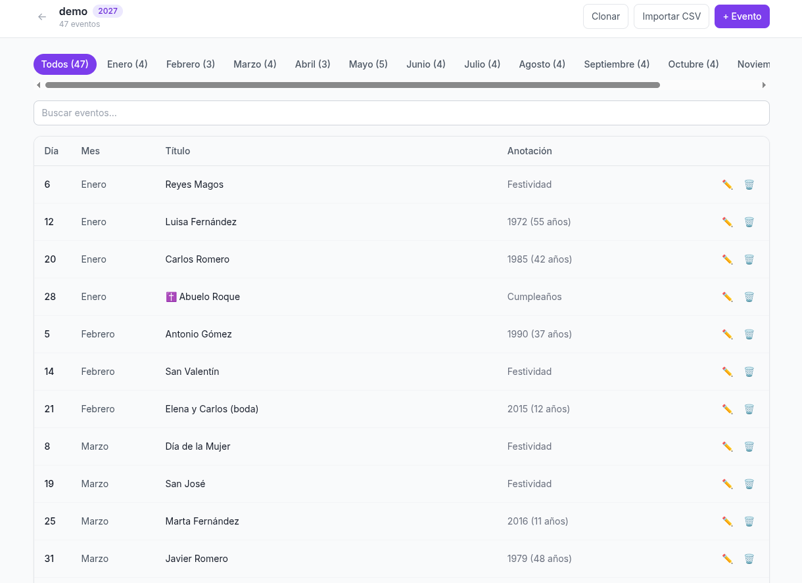
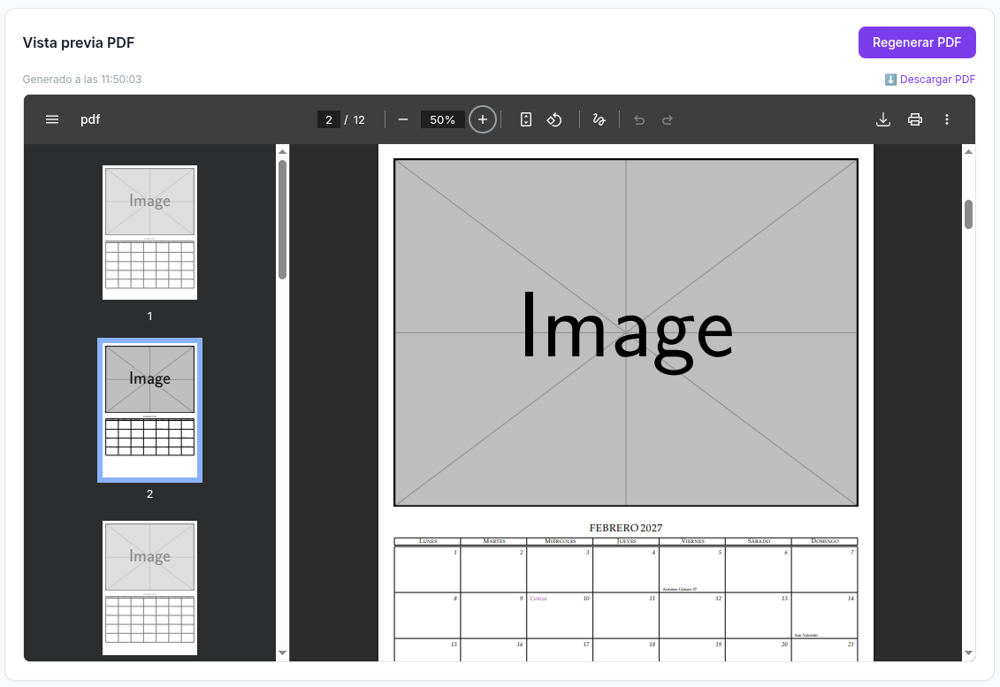

# PhotoCalendar

Aplicación web para gestionar un **calendario fotográfico personalizado**: añade eventos familiares, festivos y aniversarios, y genera un **PDF imprimible** vía LaTeX con un solo clic.


---

## Capturas

**Gestión de eventos** — filtro por mes, búsqueda, edición y borrado inline:



**Vista previa del PDF** — compilado con LaTeX y embebido en el navegador:



---

## Características

- **Múltiples calendarios** — cada uno con su propio año y conjunto de eventos (mismas fotos, datos distintos)
- **Edades calculadas automáticamente** — pon el año de nacimiento y el calendario muestra la edad ese año
- **Festivos automáticos** — Pascua, solsticios, Adviento, cambios de hora y festivos españoles/catalanes calculados para cada año
- **Validación de días** — imposible guardar 31 de abril o 29 de febrero en año no bisiesto
- **Importar CSV** — carga masiva con validación; los días inválidos se reportan sin romper la importación
- **Clonar calendario** — copia todos los eventos a un nuevo año, saltando automáticamente los días que ya no existen
- **Vista previa PDF** en el propio navegador, con descarga directa

---

## Requisitos

- [Nix](https://nixos.org/) con flakes habilitados — el entorno `flake.nix` provee **uv**, **Node.js 22** y **TeX Live completo** sin instalar nada más a mano
- Opcional: [direnv](https://direnv.net/) + [nix-direnv](https://github.com/nix-community/nix-direnv) — con `.envrc` el entorno se activa solo al entrar a la carpeta

---

## Puesta en marcha

```bash
nix develop      # entra al entorno con todas las dependencias
make install     # instala deps Python (uv sync) y frontend (npm install)
make start       # compila el frontend y arranca en http://localhost:8000
```

### Importar datos iniciales

Si tienes CSVs en `input/`, impórtalos todos de una vez tras arrancar:

```bash
curl -X POST "http://localhost:8000/api/migrate/csv?year=2027"
```

O desde la UI → botón **Importar CSV** en la pantalla de inicio.

Para probar con datos de ejemplo:

```bash
# El repositorio incluye input/demo.csv con 47 eventos de muestra
curl -X POST "http://localhost:8000/api/migrate/csv?year=2027"
```

---

## Makefile

| Comando | Qué hace |
|---|---|
| `make install` | `uv sync` + `npm install` — solo la primera vez |
| `make start` | Compila el frontend y arranca todo en `:8000` |
| `make dev-backend` | Solo el backend con hot-reload (`--reload`) |
| `make dev-frontend` | Solo Vite en `:5173` con hot-reload del UI |
| `make build` | Compila el frontend a `frontend/dist/` |

Para el día a día basta con `make start` — FastAPI sirve el frontend compilado, **un solo proceso, una sola terminal**.

Las dos terminales solo son necesarias si estás cambiando el código del frontend activamente (para tener hot-reload de React).

---

## Uso

### Flujo básico

1. **Crea un calendario** desde la pantalla de inicio (nombre en slug + año)
2. **Añade eventos** con el botón `+ Evento` — mes, día, título y tipo de anotación
3. **Filtra por mes** con las pestañas horizontales o busca por texto
4. **Genera el PDF** — LaTeX compila y el resultado aparece embebido en la misma página
5. **Descarga** con el enlace directo que aparece tras la generación

### Tipos de anotación

| Tipo | Se muestra en el calendario |
|---|---|
| Año (nacimiento, boda…) | `Nombre 38` — diferencia con el año del calendario |
| Cumpleaños sin año | Solo el nombre |
| Festividad / Santo | Solo el nombre |
| En memoria | `Nombre ✝` — cruz al final |
| Persona fallecida ☑ | `✝ Nombre` — cruz al principio (casilla en el formulario) |

### Fotos mensuales

Pon las imágenes en `images/` con el nombre del mes en minúsculas:

```
images/enero.jpeg
images/febrero.png
images/marzo.jpg
...
```

Si falta una imagen LaTeX usa un placeholder gris (`example-image`) y el PDF compila igualmente.

### Formato CSV de importación

```csv
dia,titulo,opciones,mes
31,Andrés,1989,marzo
8,Sara,1988,mayo
1,Ignasi y Ester (boda),2018,julio
25,Sant Marc,santo,abril
6,\Cross Iaia Montse,cumple,diciembre
```

Los días inválidos para el año del calendario se saltan y se listan en el resultado.

---

## Estructura del proyecto

```
photocalendar/
├── backend/
│   ├── main.py            # FastAPI: todas las rutas de la API
│   ├── calendar_gen.py    # Genera el .tex y llama a pdflatex
│   ├── data_service.py    # CRUD de calendarios y eventos en JSON
│   ├── models.py          # Modelos Pydantic
│   └── config.py          # Rutas y año por defecto (env YEAR)
├── frontend/
│   ├── src/
│   │   ├── CalendarList.tsx   # Pantalla de inicio con cards
│   │   ├── CalendarView.tsx   # Tabla de eventos + visor PDF
│   │   ├── EventModal.tsx     # Modal añadir / editar evento
│   │   └── api.ts             # Todas las llamadas a la API + helpers
│   ├── vite.config.ts         # Proxy /api → :8000 en desarrollo
│   └── tailwind.config.js
├── data/
│   └── calendars/         # Un .json por calendario
├── build/
│   ├── calendar.sty       # Paquete LaTeX del calendario
│   └── calendar.tex       # Generado en cada compilación
├── images/                # Fotos por mes: enero.jpeg, febrero.png…
├── input/                 # CSVs de importación (incluye demo.csv)
├── output/                # PDFs generados: {nombre}.pdf
├── templates/
│   └── header             # Cabecera LaTeX del documento
├── docs/                  # Capturas de pantalla
├── Makefile
├── flake.nix
└── pyproject.toml
```

---

## API

Documentación interactiva en `http://localhost:8000/docs` (Swagger UI generado automáticamente por FastAPI).

Referencia rápida:

| Método | Ruta | Descripción |
|---|---|---|
| `GET` | `/api/calendars` | Listar calendarios |
| `POST` | `/api/calendars` | Crear calendario `{name, year}` |
| `DELETE` | `/api/calendars/{name}` | Borrar calendario |
| `POST` | `/api/calendars/{name}/clone` | Clonar `{new_name, new_year}` |
| `GET` | `/api/calendars/{name}/events` | Listar eventos (`?mes=enero`) |
| `POST` | `/api/calendars/{name}/events` | Añadir evento |
| `PUT` | `/api/calendars/{name}/events/{id}` | Editar evento |
| `DELETE` | `/api/calendars/{name}/events/{id}` | Borrar evento |
| `POST` | `/api/calendars/{name}/generate` | Compilar PDF con LaTeX |
| `GET` | `/api/calendars/{name}/pdf` | Descargar PDF |
| `POST` | `/api/calendars/{name}/import-csv` | Importar CSV (multipart) |
| `POST` | `/api/migrate/csv` | Importar todos los CSVs de `input/` |

---

## Licencia

MIT.
